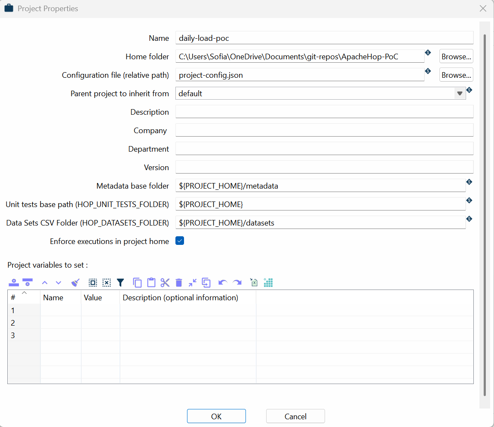
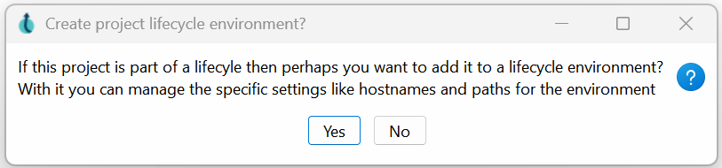
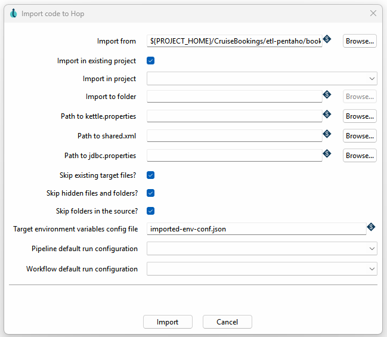
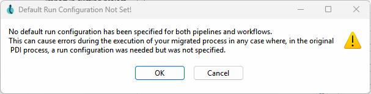
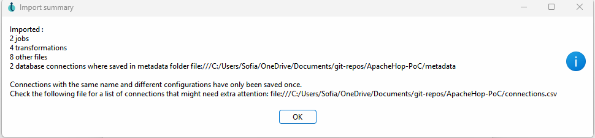
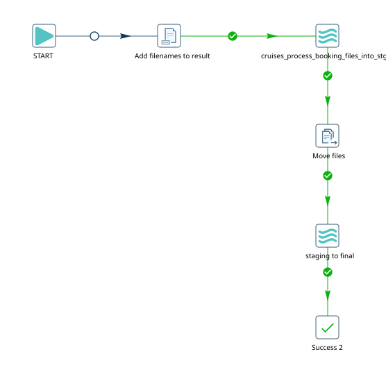
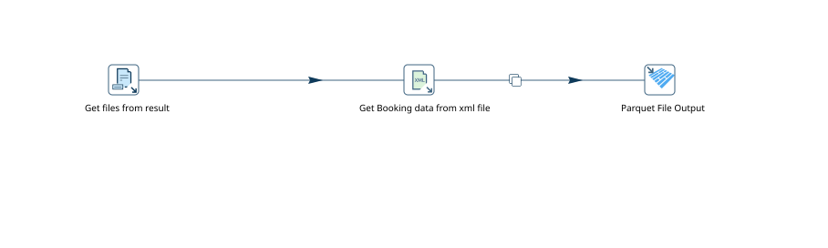

# Apache Hop – Proof of Concept (PoC) Notes

> **Status:** in progress — living document, will be updated as we move forward with the migration.

> **Author:** Sofia Arancibia (Id90 Travel)

> **Last updated:** August 14, 2026

## Purpose of this document

Record the experience of installing, configuring, and testing **Apache Hop** as a possible replacement for **Pentaho Data Integration (PDI/Kettle)** for our ETL processes, using the `CruiseBookings` flow (reading booking XML files → staging → final) as a test case. The goal is to share what we've learned so far with the team — including the stumbling blocks, not just what worked — so it serves as a reference when we evaluate a broader migration.

This document will keep growing over future iterations (more migrated pipelines, performance benchmarks, architecture decisions, etc.).

---

## 1. Context: what is Apache Hop?

Apache Hop ("Hop Orchestration Platform") is an Apache Software Foundation project, born as a fork/evolution of **Pentaho Kettle (PDI)**, created largely by the same original Kettle team. The terminology shifts slightly but the concepts map very closely:

| Pentaho / Kettle | Apache Hop |
|---|---|
| Job (`.kjb`) | Workflow (`.hwf`) |
| Transformation (`.ktr`) | Pipeline (`.hpl`) |
| Step | Transform |
| Job entry | Action |
| Spoon (design GUI) | Hop Gui |
| Carte (execution server) | Hop Server |
| Repository | Project / Environment |

"Apache Hop software is released under the Apache License v2.0 and is overseen by a self-selected team of active contributors to the project."

---

## 2. Installation and initial setup

Apache Hop officially supports two distinct installation paths — Docker for Hop Server, and the standalone client distribution for Hop Gui. This document describes only the installation via Docker.

### 2.1. Hop Server (via Docker)

To test the execution server, we used the official `apache/hop` Docker image. Per the official Docker documentation, this image supports two modes:

- **Short-lived containers**: run a single pipeline or workflow and then exit (configured via env vars like `HOP_FILE_PATH`, `HOP_PROJECT_FOLDER`, `HOP_RUN_CONFIG`, etc., with the project folder mounted as a volume).
- **Long-lived containers**: start a Hop Server that stays up waiting for incoming work — this is the mode we used.


Pull apache/hop Docker Image:

```
docker pull apache/hop
```

For our test we ran it without overriding the credentials, mapping the container's default port 8080 to a free local port:

```
docker run -p 8081:8080 apache/hop   # 8080 was already taken locally, mapped to 8081 instead
```

The server exposes its [status UI](https://hop.apache.org/manual/latest/hop-server/index.html#:~:text=2.715%20seconds%20%5B%20%202.714%22%20%5D-,CONNECT%20TO%20THE%20HOP%20SERVER%20UI,-To%20connect%20to) at:

```
http://localhost:8080/hop/status
```

**Default credentials:** `cluster` / `cluster` (both username and password) when `HOP_SERVER_USER`/`HOP_SERVER_PASS` aren't set. Basic Auth is enabled by default and **cannot currently be disabled through configuration** (per an [open discussion](https://github.com/apache/hop/discussions/5993) in the Hop repo, it requires a source code change). For production, this should always be overridden with the `HOP_SERVER_USER` / `HOP_SERVER_PASS` environment variables at container startup, as shown above.

> ⚠️ **Important:** Hop Server is only the remote execution engine — **it does not let you design** workflows/pipelines from the browser. For that you need Hop Gui (see below) or, alternatively, Hop Web (which needs to be deployed separately on top of Apache Tomcat).

### 2.2. Hop Gui (design client)

We downloaded the `apache-hop-client-2.18.1` distribution (Windows build) and run it locally via `hop-gui.bat`.

**Key requirement: Java 21 (64-bit).** This version of Hop is not compatible with Java 8 (startup fails with `Unrecognized option: --add-opens`, a typical symptom of trying to run Java 9+ module flags on an old JVM). **Adoptium** builds are also flagged as incompatible in the official docs — we used **Microsoft OpenJDK 21** instead.

Once the correct JDK is on `PATH`/`JAVA_HOME`, `hop-gui.bat` launches the design interface without issues.

### 2.3. Project and environment

When creating the first project, Hop asks whether you want to attach it to a **lifecycle environment** (an optional layer for managing different variables per stage — dev/test/prod — without touching the workflow/pipeline itself). For this PoC we chose to **skip it** (it's not mandatory and can be added later); the base project is enough to develop and test with.




---

## 3. ETL migration: from Pentaho to Hop

### 3.1. The import tool

Hop ships with a dedicated wizard (**Import code to Hop**, also available as the `hop-import` CLI) built specifically to convert Kettle/PDI projects. It automatically:

- Converts `.kjb` → `.hwf` (workflows) and `.ktr` → `.hpl` (pipelines).
- Copies the rest of the project's files as-is.
- Can import variables from `kettle.properties`, connections from `shared.xml`, and credentials from `jdbc.properties`, if those paths are provided.
- On completion, produces a summary (workflows/pipelines/files converted, connections saved) and a `connections.csv` flagging connections that **share the same name but have different configurations** (only one is kept — you need to manually review which ones got overwritten).

**Configuration used:**
- Import into an existing project + the project already created was selected (with this, "Import to folder" is intentionally disabled — the two are mutually exclusive, not a bug).
- `Skip folders in the source` **unchecked** — important, because leaving it checked (the default) only imports loose files at the root of the source folder, ignoring subfolders. Our Pentaho ETL was organized into subfolders, so leaving it checked would have imported an incomplete project with no visible error.





**Result of the first run:** 2 jobs, 4 transformations, 8 misc files, 2 database connections imported.



### 3.2. Bug found: `${PROJECT_HOME}` gets corrupted by repeated imports

When retrying the import more than once, we started seeing a "folder doesn't exist" error with the path duplicated several times over (`.../CruiseBookings/etl-hop/CruiseBookings/etl-hop/CruiseBookings/etl-hop/...`). This is a known, reported bug in the official repo ([apache/hop#2865](https://github.com/apache/hop/issues/2865)): the import wizard overwrites the project's `${PROJECT_HOME}` variable with the destination folder used in that run, instead of keeping the real project home. Each additional run of the wizard "dirties" the variable a bit more.

**Mitigation:** verify/reset the project's "Home folder" (Projects → Edit) and reopen the project (or restart Hop Gui) before retrying an import, to force the variable to reload cleanly from the saved config.

---

## 4. Building the flow (workflow + pipeline)

### 4.1. Replacing the FTP step

> ℹ️ **Note:** The original Pentaho job looked for the bookings file on an FTP server. For this PoC we moved forward with a local copy of a few of the files just to test an end-to-end flow

🔜 **SELECTED FOR A SECOND ITERATION**


### 4.2. Collecting files from a folder

An important distinction that caused confusion: **"Get files from result" is a pipeline transform**, it doesn't exist as a workflow action. On the workflow side, the equivalent is the **"Add filenames to result"** action, which adds files (by folder + wildcard/regex) to the workflow's "result list" — an internal collection (`Result.getResultFiles()`) that other actions/pipelines can later consume.

On the pipeline side, the **"Get files from result"** transform is the counterpart that reads that list and turns it into rows (`filename`, `path`, `type`, `origin`, etc.). Important detail: **this transform only has data when the pipeline is executed from the workflow** (via the "Pipeline" action) — testing it in an isolated preview always returns "No preview rows found," because that result context doesn't exist outside that execution chain.

### 4.3. Reading the XML (`Get data from XML`)

Final configuration that worked:
- `XML source is defined in a field` + `XML source is a filename` both checked.
- **`get XML source from a field` → the `path` field** (not `filename`). This was a non-obvious trap: the `filename` field coming out of "Files from result" only carries the bare file name with no directory — Hop interprets it as a path relative to the process's working directory (the Hop client's install folder, not the project), and fails with `FileNotFoundException`. The `path` field carries the full absolute path.
- `Loop XPath`: must match the actual structure of the source XML (in our case, `/Invoices/Invoice` — inherited as-is from the import, but **it's worth always confirming it with the "Get XPath nodes" button** against a real file rather than assuming the imported value is correct).
- We recommend unchecking `Do not raise an error if no files` while debugging — with that option checked, any file-not-found issue is **silently swallowed** instead of surfacing as an error, which makes diagnosis much harder.

With this configuration, the pipeline correctly processed the 5 XML files → 959 rows → written to Parquet (`Parquet File Output`).

### 4.4. Moving the already-processed files

This was the part that took the most debugging time. The **Move files** action has an option called **"Copy previous results to args"** which, by its name, looks like the natural way to chain it after "Add filenames to result." **It isn't.** Looking at the action's source code, that option specifically reads `Result.getRows()` (data rows, like what a `Copy rows to result` transform inside a pipeline would leave) — a completely separate collection from `Result.getResultFiles()`, which is what "Add filenames to result" populates. That's why, no matter how many times "Add filenames to result" was repeated before "Move files," the file count always came back `0`.

**The configuration that actually works** — bypass the "result" mechanism entirely and use the action's static grid instead:
- **General** tab → the `Files/Folders` grid, with a row where `File/Folder source`, `File/Folder destination`, and `Wildcard (RegExp)` are filled in directly (same folder/pattern as "Add filenames to result").
- **Destination file** tab → `Destination is a file` **unchecked** (so the grid's destination is treated as a folder, preserving each file's original name — not as a single file to rename).
- The `Move to folder` section is not used in this approach — it's a separate fallback mechanism, specifically tied to the `If destination file exists = "Move source file to folder"` dropdown, not a general-purpose way to move multiple files.





### 4.5. Pending stage

🚧 **WORK IN PROGRESS**

The `staging_to_final` pipeline (the next step in the flow, staging → final tables) is being build.

---

## 5. General gotchas / lessons learned about the tool

A list of non-obvious behaviors worth the team knowing upfront, so we don't lose time rediscovering them:

- **A single click on the canvas opens the action/transform picker by default.** This can be changed to "double-click only" in the **Configuration** perspective → `Use double click on canvas?` option. Worth turning on from day one — it removes a fair amount of friction. ❌ **not working on windows**
- **A grayed-out `Preview` button in a transform dialog** usually means a required field is missing (typically a field-selection dropdown) — not a bug, worth checking the config before assuming it's broken.
- **Java must be 21 (64-bit)**, not just any recent version — and avoid Adoptium builds.
- Importing from Pentaho is **not a one-click process**: particular considerations needed for each case 📆 **consider for time estimations**
- Hop's official documentation is solid for the general flow but **has gaps on edge cases** (we had to dig into GitHub issues and even source code for some actions to understand specific behaviors, like "Move files"). Worth factoring into troubleshooting time estimates.
- For debugging a pipeline/workflow, raising the logging level to **Detailed** (or **Debugging**) in the run dialog gives much better visibility than the "Basic" log. There's also the **Execution Information** perspective (`Ctrl+Shift+I`) to inspect result rows/files per action after a run, though it requires an "Execution Information Location" to be configured.

---

## 6. Early conclusions on the future migration

With the caveat that this is just a first migrated flow (not representative of the full complexity of our Pentaho ETLs), some initial impressions:

**In favor:**
- The conceptual overlap with Kettle is high — anyone already familiar with Pentaho PDI orients themselves quickly in Hop; the learning curve is more about "where things live" than about new concepts.
- The import tool automates a large chunk of the mechanical conversion work (file formats, basic structure), which meaningfully reduces effort compared to rewriting everything by hand.

**Things to keep in mind / risks:**
- Migration is **not 100% automatic** — every imported pipeline/workflow needs a non-trivial manual review (connections, XPaths, file-field mapping, etc.). For a large volume of ETLs, this implies a meaningful QA effort, not just "run the import and done."
- There are known, active bugs in the current version (e.g., the `${PROJECT_HOME}` issue with repeated imports) worth having mapped out before scaling this process to more pipelines, to avoid re-diagnosing them each time.
- Community support (GitHub discussions/issues) is active, but official documentation doesn't always cover edge cases — budget non-trivial research/debugging time into the team's initial adoption curve.
- We haven't yet evaluated performance at real production volumes, nor Hop Server's integration into a production-like setup (authentication, orchestration, monitoring) <span style="background-color: #238636; color: white; padding: 2px 8px; border-radius: 10px; font-weight: bold; font-size: 12px;">SELECTED FOR A SECOND ITERATION</span>.

**Suggested next steps:**
1. Migrate and validate the `staging_to_final` pipeline.
2. Migrate a second, more complex flow (ideally one with multiple database connections) to properly exercise the `shared.xml`/`jdbc.properties` handling in the import, which wasn't fully exercised in this first case.
3. Evaluate deploying Hop Server in a more production-like environment (proper authentication, not the `cluster`/`cluster` default).
4. Estimate migration effort at scale (time per migrated pipeline + QA) based on what we've learned here, to properly size the full project.

---

*Document in progress — recommended to revisit periodically as the PoC advances.*
